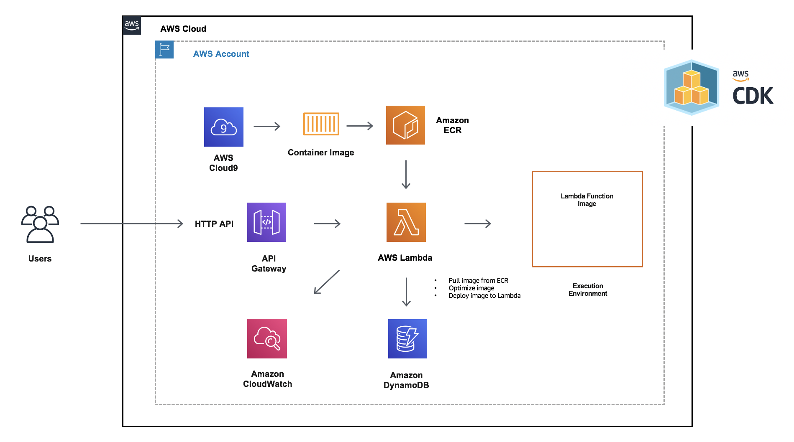
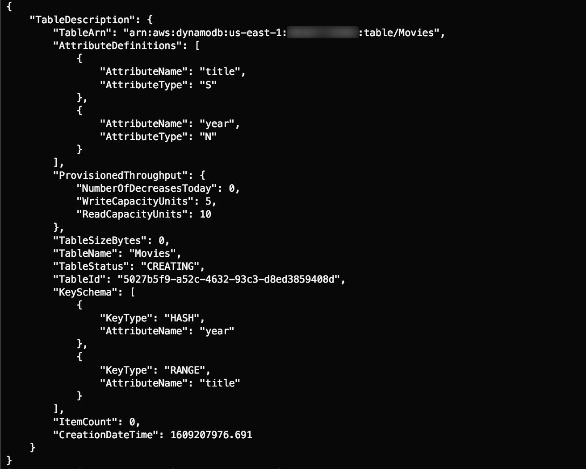
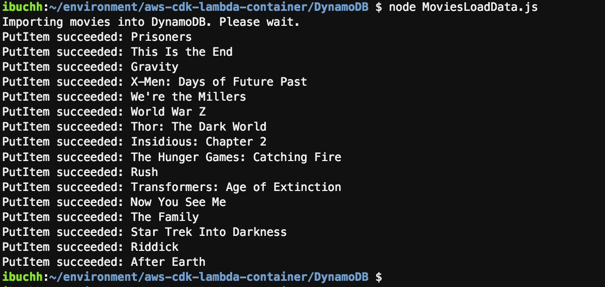
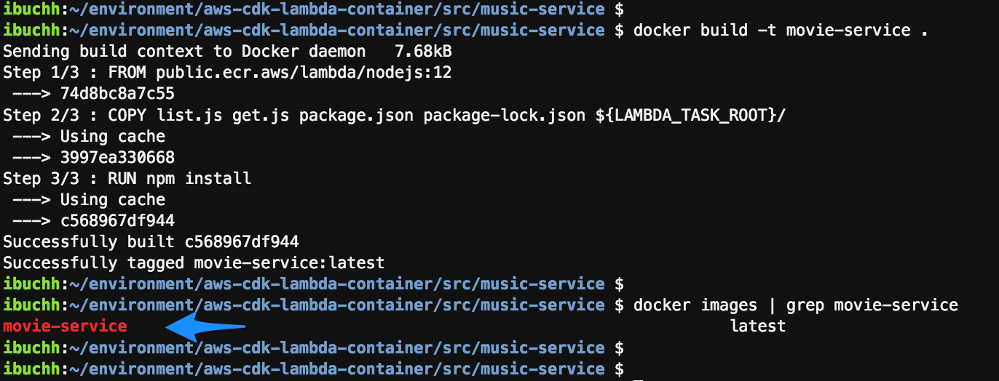
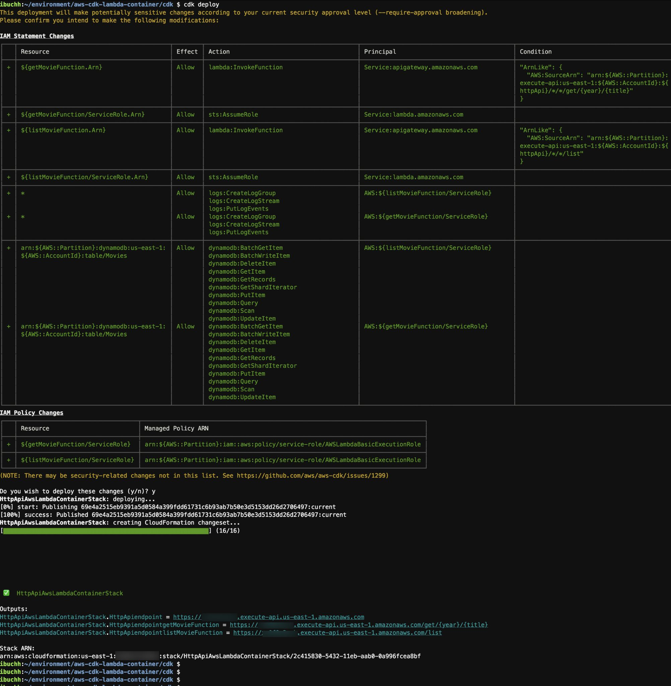
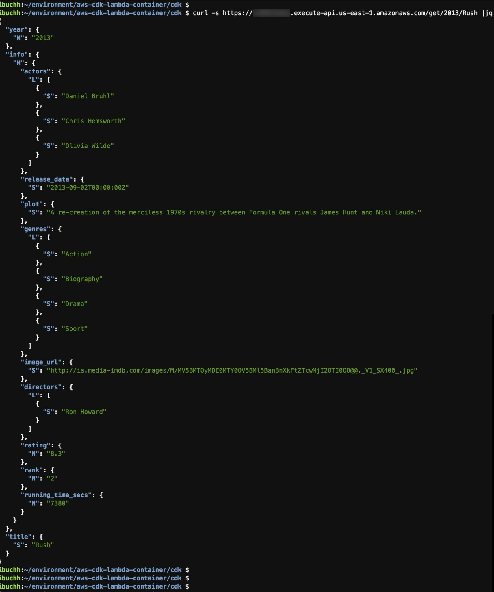
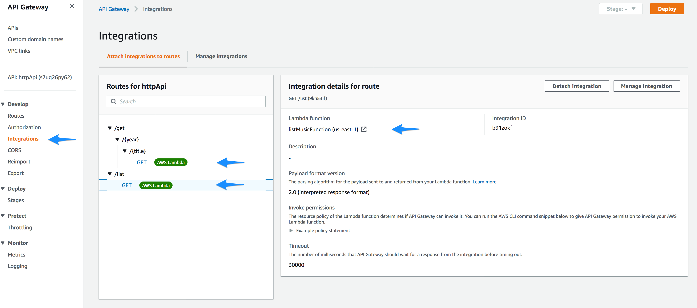
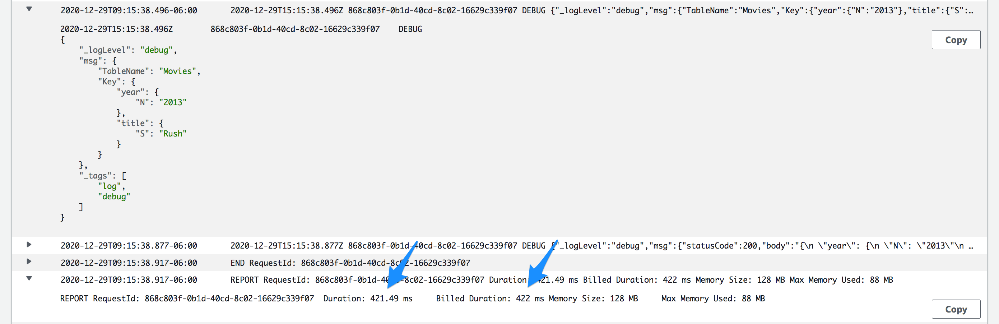

# Develop & deploy AWS Lambda functions using container image support

[](https://gitpod.io/#https://github.com/aws/aws-cdk)
[](https://badge.fury.io/js/aws-cdk)
[](https://badge.fury.io/py/aws-cdk.core)
[](https://badge.fury.io/nu/Amazon.CDK)

## Architecture


Here are the steps we’ll be following to implement the above architecture:

- Create and configure AWS Cloud9 environment
- Create Amazon DynamoDB Movies Table
- Load Sample data into Movies Table
- Create Dockerfile
- Create Lambda functions
- Build Docker image
- Test Lambda Functions locally
- Deploy Lambda functions using container image support
- Provision AWS resources using the AWS CDK
- Test the HTTP API
- Cleanup
- Conclusion

## Create and configure AWS Cloud9 environment
Log into the AWS Management Console and search for Cloud9 service in the search bar.

1. Select Cloud9 and create an AWS Cloud9 environment based on Amazon Linux 2.
    - We will be using the us-east-1 region for this example, so our Cloud9 environment will be created there.
2. Create an IAM role for Cloud9 workspace as explained [here](https://www.eksworkshop.com/020_prerequisites/iamrole/). 
3. Attach the IAM role to your workspace as explained [here](https://www.eksworkshop.com/020_prerequisites/ec2instance/). 
4. Turn off the AWS managed temporary credentials of the Cloud9 environment as explained [here](https://www.eksworkshop.com/020_prerequisites/workspaceiam/).
    - You can also resize the Amazon Elastic Block Store (Amazon EBS) volume that is associated with an Amazon EC2 instance for an environment. The detailed steps are documented [here](https://docs.aws.amazon.com/cloud9/latest/user-guide/move-environment.html#move-environment-resize).
5. Open a new terminal in Cloud9.
6. Install jq by running:
  ```bash
  sudo yum install jq -y
  ```
7. Clone the GitHub repository containing the code sample for this example:
```bash
  git clone https://github.com/aws-samples/aws-cdk-lambda-container.git
```

## Create Amazon DynamoDB Movies Table

We shall be using the example Movies table as explained [here](https://docs.aws.amazon.com/amazondynamodb/latest/developerguide/GettingStarted.NodeJs.01.html).

Let us create a Movies table with a composite Primary Key comprising:

- Partition Key --- year
- Sort Key --- title

```bash
aws dynamodb --region us-east-1 create-table \
    --table-name Movies \
    --attribute-definitions \
        AttributeName=year,AttributeType=N \
        AttributeName=title,AttributeType=S \
    --key-schema \
        AttributeName=year,KeyType=HASH \
        AttributeName=title,KeyType=RANGE \
    --provisioned-throughput \
        ReadCapacityUnits=10,WriteCapacityUnits=5
```
This will return the Movies table details as:



To verify that DynamoDB has finished creating the Movies table, use the describe-table command:

```bash
aws dynamodb --region us-east-1 describe-table --table-name Movies | grep TableStatus
```
Proceed to the next step if you get  "TableStatus": "ACTIVE". 
Otherwise if your table is marked as “CREATING”, wait a few seconds and try again.

## Load Sample data into Movies Table
```bash
cd ~/environment/DynamoDB
npm install
export AWS_REGION=us-east-1
node MoviesLoadData.js
```
This script will load sample movie data into the newly created Movies DynamoDB table.



## Query Data
Run the following command to make sure that you can query the movie data of the 2013 movie “Gravity”.

```bash
aws dynamodb --region us-east-1 \
    get-item --consistent-read \
    --table-name Movies \
    --key '{ "year": {"N": "2013"}, "title": {"S": "Gravity"}}'
```

## Create Lambda functions
We shall write a couple of Lambda functions list.js and get.js.
### list.js function: 

The function retrieves all movies in the Movies table and the code is located here: ~/environment/aws-cdk-lambda-container/src/movie-service/list.js

```javascript
'use strict';

const AWS = require('aws-sdk'); 
const log = require('lambda-log');

const dynamoDb = new AWS.DynamoDB();
const params = {
  TableName: process.env.DYNAMODB_TABLE,
};

module.exports.list = (event, context, callback) => {
  log.options.debug = true;
  log.debug(params);

  // fetch all Movies from the database
  
  dynamoDb.scan(params, (error, result) => {
    
    // handle potential errors
    if (error) {
      console.error(error);
      callback(null, {
        statusCode: error.statusCode || 501,
        headers: { 'Content-Type': 'text/plain' },
        body: 'Couldn\'t fetch the Movies.',
      });
      return;
    }

    // create a response
    const response = {
      statusCode: 200,
      body: JSON.stringify(result.Items),
    };
    log.debug(response);
    callback(null, response);
  });
};
```
We are also using the universal JSON logger NPM package lambda-log.

### get.js function: 

The function retrieves a movie item from the Movies table based on two input parameters, the year and title of the movie. These parameters are later passed into this function through an HTTP API via API Gateway. The get.js function code is located here: ~/environment/aws-cdk-lambda-container/src/movie-service/get.js

```javascript
'use strict';

const AWS = require('aws-sdk');
const log = require('lambda-log');

const dynamoDb = new AWS.DynamoDB();

module.exports.get = (event, context, callback) => {
  var params = {
    TableName: process.env.DYNAMODB_TABLE,
    Key: {
      "year": { "N": event.pathParameters.year },
      "title": { "S": event.pathParameters.title.toString() }
    }
  };

  log.options.debug = true;
  log.debug(params);

  // fetch Movie from the database
  dynamoDb.getItem(params, (error, result) => {
    // handle potential errors
    if (error) {
      console.error(error);
      callback(null, {
        statusCode: error.statusCode || 501,
        headers: { 'Content-Type': 'text/plain' },
        body: 'Couldn\'t fetch the Movie.',
      });
      return;
    }

    // create a response
    const response = {
      statusCode: 200,
      body: JSON.stringify(result.Item),
    };
    log.debug(response);
    callback(null, response);
  });
};
```
## Create Dockerfile
A Dockerfile is a text document that contains all the commands a user could call on the command line to assemble a container image. You’ll find a Dockerfile in your current workspace under:
   ~/environment/aws-cdk-lambda-container/src/movie-service/Dockerfile

```docker
FROM public.ecr.aws/lambda/nodejs:12
# Alternatively, you can pull the base image from Docker Hub: amazon/aws-lambda-nodejs:12

# Copy the Lambda functions
COPY list.js get.js package.json package-lock.json ${LAMBDA_TASK_ROOT}/

# Install NPM dependencies for function
RUN npm install
```
This Dockerfile specifies the publicly available AWS base image for Lambda with NodeJS 12 public.ecr.aws/lambda/nodejs:12. It copies the list.js, get.js, package.json and package-lock.json files into the ${LAMBDA_TASK_ROOT} folder, then runs npm install to fetch the function’s dependencies. The ${LAMBDA_TASK_ROOT} represents the path to our Lambda functions as documented in the AWS Documentation on using AWS Lambda environment variables. 

## Build Docker image

Now that we have written the Dockerfile and the two lambda functions, let’s take a look at building our Docker container image. A container image includes everything you need to run an application - the code or binary, runtime, dependencies, and any other file system objects required. 
From the Cloud9 terminal run the following commands:

cd ~/environment/aws-cdk-lambda-container/src/movie-service
docker build -t movie-service .
docker images | grep movie-service




## Test Lambda Functions locally
In order to locally test our Lambda functions packaged as a container image, we shall use AWS Lambda Runtime Interface Emulator (RIE) which is a proxy for the Lambda Runtime API.
The Lambda Runtime Interface Emulator (RIE) is a lightweight web server that converts HTTP requests into JSON events to pass to the Lambda functions in the container image. We shall  configure these environment variables: AWS_ACCESS_KEY_ID, AWS_SECRET_ACCESS_KEY, AWS_SESSION_TOKEN, AWS_REGION and DYNAMODB_TABLE

**Run list.js function:** From the Cloud9 terminal run the following command. This command runs the movie-service image as a container and starts up an endpoint for list.js function locally at : http://localhost:9080/2015-03-31/functions/function/invocations. 

```bash
docker run \
    --env DYNAMODB_TABLE=Movies \
    --env AWS_ACCESS_KEY_ID="$(aws configure get default.aws_access_key_id)" \
    --env AWS_SECRET_ACCESS_KEY="$(aws configure get default.aws_secret_access_key)" \
    --env AWS_SESSION_TOKEN="$(aws configure get default.aws_session_token)" \
    --env AWS_REGION="$(aws configure get default.region)" \
    -p 9080:8080 \
    movie-service list.list

```
**Test list.js function:** Open a new Cloud9 terminal and run the following command. This command invokes list.js function.
```bash
curl -s -XPOST "http://localhost:9080/2015-03-31/functions/function/invocations" -d '{}' | jq
```

**Run get.js function:** From the Cloud9 terminal run the following command. The following command runs the movie-service image as a container and starts up an endpoint for get.js function locally at: http://localhost:9080/2015-03-31/functions/function/invocations. 

```bash
docker run \
    --env DYNAMODB_TABLE=Movies \
    --env AWS_ACCESS_KEY_ID="$(aws configure get default.aws_access_key_id)" \
    --env AWS_SECRET_ACCESS_KEY="$(aws configure get default.aws_secret_access_key)" \
    --env AWS_SESSION_TOKEN="$(aws configure get default.aws_session_token)" \
    --env AWS_REGION="$(aws configure get default.region)" \
    -p 9080:8080 \
    movie-service get.get
```

**Test get.js function:** Open a new Cloud9 terminal and run the following command. This command invokes get.js function with two path parameters year=2013 and title=”Rush”.
```bash
curl -s "http://localhost:9080/2015-03-31/functions/function/invocations" -d '{"pathParameters": {"year": "2013", "title": "Rush"} }' | jq
```

## Deploy Lambda Functions using container image support
### Install AWS CDK

The [AWS Cloud Development Kit (AWS CDK)](https://aws.amazon.com/cdk/) is an open-source software development framework to model and provision your cloud application resources using familiar programming languages. If you would like to familiarize yourself the CDKWorkshop is a great place to start.
Using Cloud9 environment, open a new terminal and use the following commands:
```bash
cd ~/environment/aws-cdk-lambda-container/cdk
npm install 
```

This will install all the latest CDK modules under the node_modules directory.

## Creating AWS resources using the CDK
We shall implement this architecture using an AWS CDK application consisting of one CDK stack written in typescript. Under the cdk/lib folder, open the http-api-aws-lambda-container-stack.ts file and let us explore the following different CDK constructs.

### DynamoDB table
Since we have created the Movies DynamoDB table earlier using AWS cli, we can import this existing table using AWS CDK as documented [here](https://docs.aws.amazon.com/cdk/api/latest/docs/@aws-cdk_aws-dynamodb.ITable.html).

```typescript
const table = dynamodb.Table.fromTableName(this, 'MoviesTable', 'Movies');
```

### Lambda functions
Developers can now package and deploy AWS Lambda functions as a container image of up to 10 GB. This makes it easy to build Lambda based applications using familiar container tooling, workflows, and dependencies. Let us create two Lambda functions using AWS CDK as documented [here](https://docs.aws.amazon.com/cdk/api/latest/docs/@aws-cdk_aws-lambda.DockerImageFunction.html). The code attribute is using [static fromImageAsset(directory, props?)](https://docs.aws.amazon.com/cdk/api/latest/docs/@aws-cdk_aws-lambda.DockerImageCode.html#static-fromwbrimagewbrassetdirectory-propsspan-classapi-icon-api-icon-experimental-titlethis-api-element-is-experimental-it-may-change-without-noticespan) method of the [DockerImageCode](https://docs.aws.amazon.com/cdk/api/latest/docs/@aws-cdk_aws-lambda.DockerImageCode.html) class and it picks up the Dockerfile under src/movie-service directory.

**listMovieFunction:**

```typescript
const listMovieFunction = new lambda.DockerImageFunction(this, 'listMovieFunction',{
    functionName: 'listMovieFunction',
    code: lambda.DockerImageCode.fromImageAsset(path.join(__dirname, '../../src/movie-service'), {
    cmd: [ "list.list" ],
    entrypoint: ["/lambda-entrypoint.sh"],
    }),
    environment: {
            DYNAMODB_TABLE: this.table.tableName
    },
});
```
**getMovieFunction:**

```typescript
const getMovieFunction = new lambda.DockerImageFunction(this, 'getMovieFunction',{
    functionName: 'getMovieFunction',
    code: lambda.DockerImageCode.fromImageAsset(path.join(__dirname, '../../src/movie-service'), {
    cmd: [ "get.get" ],
    entrypoint: ["/lambda-entrypoint.sh"],
    }),
    environment: {
            DYNAMODB_TABLE: this.table.tableName
    },
});
```
### Lambda proxy integrations
Amazon API Gateway Lambda proxy integration is a simple, powerful, and nimble mechanism to build an API with a setup of a single API method. The Lambda proxy integration allows the client to call a single Lambda function in the backend. In Lambda proxy integration, when a client submits an API request, API Gateway passes to the integrated Lambda function the raw request as-is, except that the order of the request parameters is not preserved. Let us create two Lambda proxy integrations for the two Lambda functions using LambdaProxyIntegration class which takes LambdaProxyIntegrationProps as an argument.

**listMovieFunctionIntegration:** 

```typescript
const listMovieFunctionIntegration = new apigintegration.LambdaProxyIntegration({
handler: listMovieFunction,
});
```
**getMovieFunctionIntegration:**

```typescript
const getMovieFunctionIntegration =  new apigintegration.LambdaProxyIntegration({
      handler: getMovieFunction,
});
```

### HTTP API
HTTP APIs enable developers to create RESTful APIs with lower latency and lower cost than REST APIs. We can use HTTP APIs to send requests to AWS Lambda functions. We shall  create an HTTP API that integrates with the two Lambda functions on the backend. When a client calls this API, API Gateway sends the request to the Lambda function and returns the function's response back to the client. Here is the code for the [HTTP API](https://docs.aws.amazon.com/cdk/api/latest/docs/@aws-cdk_aws-apigatewayv2.HttpApi.html) with a default stage.

```typescript
const httpApi = new apig.HttpApi(this, "httpApi", {
  apiName: "httpApi",
  createDefaultStage: true,
});
```

### HTTP API Routes
HTTP API Routes consist of two parts: an HTTP method and a resource path and routes direct incoming API requests to backend resources like AWS Lambda functions. We shall add GET /list route to integrate with the listMovieFunction Lambda function and GET /{year}/{title} route to integrate with the getMovieFunction Lambda function. For additional details, please refer to the HttpRoute class [here](https://docs.aws.amazon.com/cdk/api/latest/docs/@aws-cdk_aws-apigatewayv2.HttpRoute.html).

```typescript
httpApi.addRoutes({
  integration: listMovieFunctionIntegration, 
  methods: [apig.HttpMethod.GET], 
  path: '/list',
});

httpApi.addRoutes({
  integration: getMovieFunctionIntegration,
  methods: [apig.HttpMethod.GET],
  path: '/get/{year}/{title}',
});
```

## Provision AWS resources using the AWS CDK
Using Cloud9 environment, open a new terminal and use the following commands:
```bash
cd ~/environment/aws-cdk-lambda-container/cdk
```
Compile the Typescript into a CDK program use this command:
``bash
npm run build
```
Let us use the us-east-1 region.
```bash
export AWS_REGION=us-east-1
```
To create that S3 bucket and any other infrastructure the CDK requires, run this command:
```bash
cdk bootstrap 
```
The CDK uses the same supporting infrastructure for all projects within a region, so you only need to run the bootstrap command once in any region in which you create CDK stacks.

Finally launch the stack using this command:
```bash
cdk deploy
```
(Enter “y” in response to Do you wish to deploy all these changes (y/n)?).

**Tip –** If you get stuck on an inexplicable error, check package.json and confirm that all CDK libraries have the same version number (with no leading caret ^). Many mysterious CDK project errors stem from mismatched versions. If necessary, correct the version numbers, delete the package-lock.json file and node_modules tree and run npm install. 

The syntax and additional details of these commands are documented [here](https://docs.aws.amazon.com/cdk/latest/guide/cli.html#cli-commands).



## Test the HTTP API
Take a note of the Http Api endpoints of the List and Get Lambda Functions as shown above. Using the Cloud9 terminal run the following commands:
```bash
curl -s https://xxxxxxxxx.execute-api.us-east-1.amazonaws.com/list | jq

curl -s https://xxxxxxxxx.execute-api.us-east-1.amazonaws.com/get/2013/Rush | jq
```



## AWS API Gateway (AWS Management Console)
Here is the integration of the Http Api with the backend Lambda functions inside the AWS Management Console.



## AWS Lambda 1ms billing
AWS Lambda reduced the billing granularity for Lambda function duration from 100ms down to 1ms. This will lower the price for most Lambda functions, more so for short duration functions. Their compute duration will be billed in 1ms increments instead of being rounded up to the nearest 100 ms increment per invocation.



## Cleanup

To clean up the resources created by the CDK, run the following commands in a terminal of your Cloud9 instance:
```bash
cd ~/environment/aws-cdk-lambda-container/cdk
cdk destroy
```
(Enter “y” in response to: Are you sure you want to delete (y/n)?).

To clean up the Movies DynamoDB table created manually, run the following commands:
```bash
aws dynamodb --region us-east-1  delete-table --table-name  Movies
```

## Conclusion

The AWS Cloud Development Kit (AWS CDK) lets developers define their cloud infrastructure as code in one of five supported programming languages instead of JSON or YAML. In order to create complex and complete architectures, AWS CDK saves developers time and effort in writing code using one of the scripting languages of their choice.


